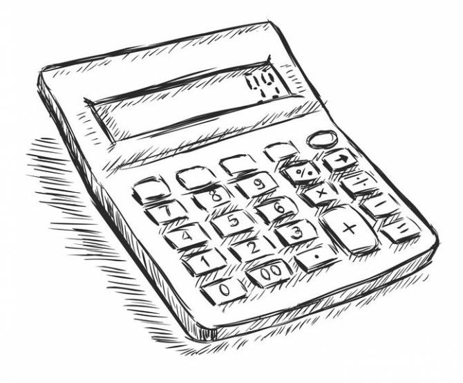

# Calculator

***It is intended for you to have *qt core gui* installed since "make install" uses *qmake* for building***
***if not, there is a binary file in the App folder***

This program was developed in accordance with principles of Google C++ Style guide.
This application is an educational project and not guaranteed to be fully correct in real life using.
This apllication is distributed under *GNU GPL*.
The main purpose is an effort to make easily scaled app.
The program is developed using *MVC pattern* for its structure.
The graphic user interface is simple, similar to traditional calcs and is not needed for explaining and specifying.

## 1 Traditional calculator

The program is developed using *RPN* in conjuction with *Dijkstra's algorithm* for computation logic.
To add new computation functionality you just should:
- append a button in GUI.
- write a certain "string" token into the string passed to model by using QT signal-slot mechanism
- append token representation in the form of node (funcs **ParseUnary ParseBinary ParseOpnds**)
- append token computing mechanism in **ComputeUnary ComputeBinary**

- you can write numbers and give an answer;
- you can write expression with "x", fill in x-field and give an answer;
- you can write expression with "x", define borders and draw a graph.

**CAUTION:** there is no asymptotes handling in graphs so be careful when write such funcs:
    you will get very large values on "Y" axis and therefore ugly graphs (at the same time they will be correct graphs) due to UNcorrelation of X-Y scale.
*TIP* in many cases the correctly choosen top and border bottoms can reduce ugliness of asymptotic graphs.

## 2 Credit calculator

The program allows to evaluate benefits and costs when take a credit under certain conditions.
There were not perfomed unit tests due to too simple business logic and presense of online instruments.
The **"https://www.sravni.ru/kredity/kalkuljator/"** was used to choose appearance and check computation correctness.

## 3 Deposit calculator

The program allow to evaluate benefits and costs when put a deposit under certain conditions.
There were not perfomed unit tests due to too simple business logic and precense of online instruments.
The **"https://calcus.ru/kalkulyator-vkladov"** was used to appearance and check computation correctness.